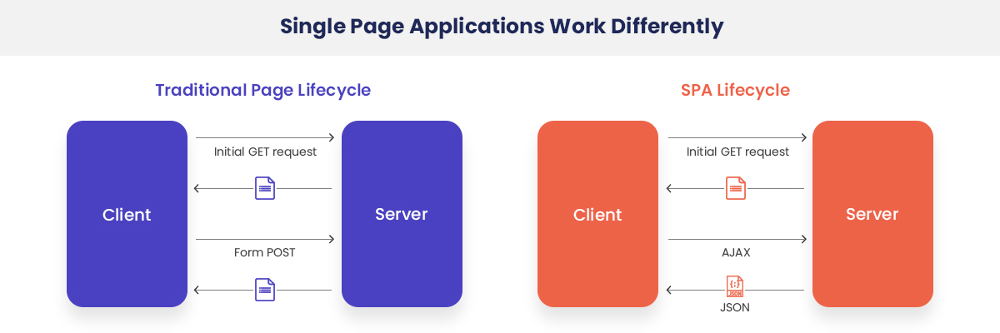

# 리액트 라우터로 SPA 개발하기

## 13-1 SPA 란?

- Single Page Application의 약자
- 한개의 페이지로 이루어진 애플리케이션

### 전통 웹페이지 방식과의 차이점



### SPA의 장단점

1. 장점

   - 하나하나 화면 전체를 렌더링할 필요가 없기 때문에 화면이동이 빠름
   - 화면에 필요한 부분의 데이터만 받아서 렌더링 하기 때문에 처리과정이 효율적임
   - 유저에 입장해서 사용하기 편리하다.

2. 단점
   - 처음 화면을 로딩할 때, 모든 화면이 미리 준비되어 있어야 하기 때문에 로딩에 시간이 걸림
   - 어플리케이션을 구현하는데 보다 시간이 걸리며 복잡하다.
   - 앱의 규모가 커지면 자바스크립트 파일도 커짐

## 사용해보기

1. react-router-dom 설치하기
2. index.js 에서 BrowserRouter 컴포넌트로 감싸기

```javascript
import React from "react";
import ReactDOM from "react-dom";
import { BrowserRouter } from "react-router-dom";
import "./index.css";
import App from "./App";
import * as serviceWorker from "./serviceWorker";

ReactDOM.render(
  <BrowserRouter>
    <App />
  </BrowserRouter>,
  document.getElementById("root")
);

serviceWorker.unregister();
```

3. 페이지 만들기

- Home.js

```javascript
import React from "react";

const Home = () => {
  return (
    <div>
      <h1>홈</h1>
      <p>홈 입니다.</p>
    </div>
  );
};

export default Home;
```

- About.js

```javascript
import React from "react";

const About = () => {
  return (
    <div>
      <h1>소개</h1>
      <p>소개 입니다.</p>
    </div>
  );
};

export default About;
```

4. 라우팅

- App.js

```javascript
import React from "react";
import { Route, Link } from "react-router-dom";
import About from "./About";
import Home from "./Home";

const App = () => {
  return (
    <div>
      <ul>
        <li>
          {/*링크 걸기*/}
          <Link to="/">홈</Link>
        </li>
        <li>
          <Link to="/about">소개</Link>
        </li>
      </ul>
      <hr />
      {/* 라우팅 (exact 는 일치할때) */}
      <Route path="/" component={Home} exact={true} />
      {/* path 는 배열로도 설정 가능 (여러 페이지에서 같은 컴포넌트를 보여줄 수 있음) */}
      <Route path={["/about", "/info"]} component={About} />
    </div>
  );
};

export default App;
```

## 13-2 URL 파라미터와 쿼리

- 페이지 주소에 유동적인 값을 전달할때 사용
- 파라미터 예시 : /profiles/velopert
- 쿼리 예시: /about?details=true

### 파라미터 사용범

- match 객체 사용

- Profile.js

```javascript
import React from "react";

const data = {
  velopert: {
    name: "김민준",
    description: "리액트를 좋아하는 개발자",
  },
  woojin: {
    name: "조우진",
    description: "리액트를 공부중인 개발자",
  },
};

const Profile = ({ match }) => {
  const { username } = match.params;
  const profile = data[username];
  if (!profile) {
    return <div>존재하지 않는 사용자입니다.</div>;
  }
  return (
    <div>
      <h1>
        {username}({profile.name})
      </h1>
      <p>{profile.description}</p>
    </div>
  );
};

export default Profile;
```

- App.js

```javascript
import React from "react";
import { Route, Link } from "react-router-dom";
import Profile from "./Profile";

const App = () => {
  return (
    <div>
      <ul>
        <li>
          <Link to="/profile/velopert">velopert 프로필</Link>
        </li>
        <li>
          <Link to="/profile/woojin">조우진 프로필</Link>
        </li>
      </ul>
      <hr />
      <Route path="/profile/:username" component={Profile} />
    </div>
  );
};

export default App;
```

### 쿼리 사용법

- location 객체를 이용

- location object ex)

```json
{
  "pathname": "/about",
  "search": "?detail=true",
  "hash": ""
}
```

1. qs 추가하기
2. location 객체를 이용하여 처리하기

- About.js

```javascript
import React from "react";
import qs from "qs";

const About = ({ location }) => {
  const query = qs.parse(location.search, {
    ignoreQueryPrefix: true, // 이 설정을 통해 문자열 맨 앞의 ? 생략
  });
  const showDetail = query.detail === "true";
  return (
    <div>
      <h1>소개</h1>
      <p>소개 입니다.</p>
      {showDetail && <p>detail 값을 true 로 설정하셨군요!</p>}
    </div>
  );
};

export default About;
```

## 13-3 서브 라우트

- 라우트 내부에 라우트를 또 정의하는것
- 따로 컴포넌트를 만들기 애매한 상황 or 컴포넌트에 props 를 넣어주고 싶을때 사용

```javascript
<Route
  path="profiles"
  exact
  render={() => <div>사용자를 선택해주세요</div>}>
```

```javascript
<Route path="/profiles" component={Profiles}>
```

## 13-4 리액트 라우터 부가 기능

### 1. history 객체

- match, location 과 같이 함께 전달되는 props 중 하나
- 라우터 api 호출 가능 (뒤로 가거나, 화면 전환 하거나, 이탈 방지시)

ex) HistorySample.js

```javascript
import React, { Component } from "react";

class HistorySample extends Component {
  // 뒤로 가기
  handleGoBack = () => {
    this.props.history.goBack();
  };

  // 홈으로 이동
  handleGoHome = () => {
    this.props.history.push("/");
  };

  componentDidMount() {
    // 페이지 변화시 나갈지 체크
    this.unblock = this.props.history.block("정말 떠나실건가요?");
  }

  componentWillUnmount() {
    // 컴포넌트가 언마운트 되면 질문을 멈춤
    if (this.unblock) {
      this.unblock();
    }
  }

  redner() {
    return (
      <div>
        <button onClick={this.handleGoBack}>뒤로</button>
        <button onClick={this.handleGoHome}>홈으로</button>
      </div>
    );
  }
}

export default HistorySample;
```

### 2. withRouter 함수

- HoC (Higher-order Component)
- 라우터로 사용된 컴포넌트가 아니어도 match, location, history 객체를 사용 가능하게 해줌

ex) withRouterSample.js

```javascript
import React from "react";
import { withRouter } from "react-router-dom";

const WithRouterSample = ({ location, match, history }) => {
  return (
    <div>
      <h4>{location}</h4>
      <h4>{match}</h4>
      <button onClick={() => history.push("/")}>홈으로</button>
    </div>
  );
};

export default WithRouterSample;
```

### 3. Switch 컴포넌트

- 여러 Route 를 감싸서 그중 일치하는 단 하나의 라우트만 렌더링
- 모든 Route와 일치하지 않을시 보여줄 Not Found Page 구현 가능

```javascript
<Switch>
  <Route path="/" component={Home} exact={true} />
  <Route path="/profile/:username" component={Profile} />
  // path 를 정의하지 않으면 모든 상황에 렌더링
  <Route
    render={({ location }) => (
      <div>
        <h2>이 페이지는 존재하지 않습니다.</h2>
        <p>{location.pathname}</p>
      </div>
    )}
  />
</Switch>
```

### 4. NavLink

- 현재 경로와 Link 에서 사용하는 경로가 일치할 경우 특정 스타일 혹은 CSS 클래스 적용가능
- activeStyle or activeClassName 을 props 로 전달

ex) Profiles.js

```javascript
import React from "react";
import { NavLink, Route } from "react-router-dom";
import Profile from "./Profile";

const Profiles = () => {
  const activeStyle = {
    background: "black",
    color: "white",
  };

  return (
    <div>
      <h3>사용자 목록</h3>
      <ul>
        <li>
          <NavLink activeStyle={activeStyle} to="/profiles/velopert" active>
            velopert
          </NavLink>
        </li>
        <li>
          <NavLink activeStyle={activeStyle} to="/profiles/woojin" active>
            조우진
          </NavLink>
        </li>
      </ul>
    </div>
  );
};

export default Profiles;
```